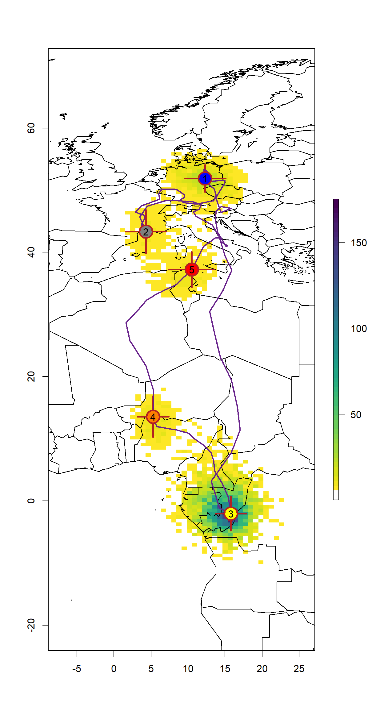

# SGAT {#SGAT}

The package _SGAT_ (TAGS backwards) is based in the principles that haven been developed for the _tripEstimation_ package that has now been deprecated by _SGAT_. The biggest difference between these two packages is the possibility to use twilight events to run the mode. _tripEstimation_ was based solely on the curve method. However, _SGAT_ has additional capabilities that we will discuss in the workflow below. Here, we highlight the _groupModel_, and the _twilightFree_ model as recent developments with great potential.

In general, _SGAT_ implements two models - \textbf{Estelle} and \textbf{Stella}. Both models can be setup using threshold based twilight events or twilight period (_curve method_), but impose different constraints on the movement of the tag.  Stella estimates the locations $x_{1},x_{2},\ldots,x_{n}$ of the tag at the observed times of twilight $t_{1},t_{2},\ldots,t_{n}$ assuming the great circle distance between any two successive locations $x_{i}$ and $x_{i+1}$ follows a given distribution.  Estelle also considers intermediate locations $z_{1},z_{2},\ldots,z_{n-1}$, where $z_{i}$ is the location of the tag at an arbitrary time $\tau_{i}$ between twilights $t_{i} < \tau_{i} t_{i+1}$, and assumes the great circle distance along any dog-leg path $x_{i},z_{i},x_{i+1}$ follows a given distribution.

Both models estimate location based on observed times of twilight. More precisely, let $t=(t_{1},t_{2},\ldots,t_{n})$ denote the observed times of twilight, let $x=(x_{1},x_{2},\ldots,x_{n})$ denote the corresponding locations of the tag at these times, and let $r=(r_{1},r_{2},\ldots,r_{n})$ be indicators of whether each twilight is a sunrise or sunset. Let $\hat{t}_{i}(x)$ denote the true time at which the twilight corresponding to $t_{i}$ occurs at location $x$.

Both models assume that

$$t_{i} \sim F(\hat{t}_{i}(x_{i}); r_{i},\alpha)$$

for some known distribution $F$ dependent upon a vector of (known) parameters $\alpha$.

The two models differ in the way they represent the motion of the tag between successive twilights.

Let $d = (d_{1},d_{2},\ldots,d_{n-1}) = D(x)$ denote the vector of great circle distances $d_{i}$ between successive locations
$x_{i}$ and $x_{i+1}$.  Stella assumes the joint distribution of these distances is

$$d \sim G(\beta)$$

for some known distribution $G$ dependent upon a vector of (known) parameters $\beta$.  This package implements a less general form of model in which it is assumed the $d_{i}$ are independently distributed

$$d_{i} \sim G_{i}(\beta).$$

Together, the twilight and behavioural models define the likelihood for the model.  If $p(x_{i})$ denote independent priors for the locations then the posterior distribution for $x$ under the Stella model can be written

$$
  p( x \;|\; t,r,\alpha,\beta) \propto
  \left (
    \prod_{i=1}^{n} f(t_{i}\;|\; \hat{t}_{i}(x_{i}),r_{i},\alpha)
  \right )
  \times g(D(x)|\beta)
  \times
  \left(
    \prod_{i=1}^{n} p(x_{i}).
  \right )
$$

Similarly, if $p(z_{i})$ denote independent priors for the intermediate points $z_{i}$, then the posterior under the Estelle model can be written

$$
  p( x,z \;|\; t,r,\alpha,\beta) \propto
  \left (
    \prod_{i=1}^{n} f(t_{i}\;|\; \hat{t}_{i}(x_{i}),r_{i},\alpha)
  \right )
  \times g(D(x,z)|\beta)
  \times
  \left (
    \prod_{i=1}^{n} p(x_{i}) \right ) \times \left( \prod_{i=1}^{n-1} p(z_{i})
  \right ).
$$

In both cases a sequence of samples from the posterior can be drawn by standard MCMC techniques.


## Getting started {-}

To illustrate the _SGAT_ analysis, we use the European bee-eater dataset. The light intensities were recorded by a geolocator from the Swiss Ornithological Institute, measuring light every minute writing the mean of every 5 measurements. Thus, we do not need ot adjust the sunset times.

We first define the metadata and read in the raw recordings. We skip the twilight definition process but read in the twilight file that has been generated using `preprocessLight`. Note: it is required to retransform the Twilight column into the `POSIXc`format.


```r
ID <- "14SA"
Species <- "MerApi"

lon.calib <- 11.96
lat.calib <- 51.32

wd <- "data"

raw <- glfTrans(paste0(wd, "/RawData/", Species, "/", ID, ".glf"))
  names(raw) <- c("Date", "Light")
  raw$Light  <- log(raw$Light+0.0001) + abs(min(log(raw$Light+0.0001)))
  
twl <- read.csv(paste0(wd, "/Results/", Species, "/", ID, "_twl.csv"))
  twl$Twilight <- as.POSIXct(twl$Twilight, tz = "UTC")
  twl <- twl[!twl$Deleted,]
  
raw <- subset(raw, Date>=min(twl$Twilight) & Date<=max(twl$Twilight)) # clipping raw data to relevant extent  
```

We can have a look into the data using the `lightImage` function from the `TwGeos` package:


```r
offset <- 12 # adjusts the y-axis to put night (dark shades) in the middle

lightImage( tagdata = raw,
            offset = offset,     
            zlim = c(0, 20))

tsimagePoints(twl$Twilight, offset = offset, pch = 16, cex = 1.2,
              col = ifelse(twl$Rise, "firebrick", "cornflowerblue"))
```


There are some sunrises and sunsets that have been misclassified, so we can use the `twlightEdit` function to move these to where they should be. 


```r
twl <- twilightEdit(twilights = twl,
                    offset = offset,
                    window = 4,           # two days before and two days after
                    outlier.mins = 45,    # difference in mins
                    stationary.mins = 25, # are the other surrounding twilights within 25 mins of one another
                    plot = TRUE)
```


<div style="background-color:rgba(0, 0, 0, 0.0470588); border-radius: 10px; text-align:left; vertical-align: middle; padding:6px 2; width: 700px; margin: auto:">

It's usually best to do this step manually. See the [Twilight annotation](#TwilightAnnotation) page for more information.
</div>


## Calibration {-}

Calibration for the _SGAT_ process is similar to the calibration performed in the _GeoLight_ analysis. Both, the _zero_ and the _median_ sun elevation angles, as well as the parameters for the error distribution of the twilight times is crucial for the analysis. **However**, while we use sun elevation angles in _GeoLight_ we need the **zenith** angle in _SGAT_. The difference is trivial; sun elevation angle refers to the deviation of the sun relative to the horizon, whereas the zenith angle refers to the deviation from the zenith. Thus, civil twilight is defined as the time when the sun elevation angle is -6 degrees which equals a zenith angle of 96 degrees.

The simple conversion of sun elevation angle to zenith angle is:

$$zenith = 90 - sun elevation angle$$

There are multiple ways to define the time period for calibration. Best is to know when the individual left the deployment site and if there where a couple of weeks between deployment and departure. In many instances the departure date (or the arrival to the retrieval site) is unknown. The `lightImage` together with the `tsimageDeploymentLine` can help to define suitable period (the right time period can be optimized by changing the date in the `tm.calib` vector and plotting the lines over and over again until you are sure that you have selected the beginning and the end of the calibration period). Again, the longer the period the better, but periods that are influenced by e.g. breeding in nest boxes or by movements should be excluded.

More specifically, `lightImage` visually presents night (in black) and day (white) throughout the year. This allows us to see when changes in night length occur and thus when the bird has moved. Based on this, we can identify when the bird left the deployment site and manually specify these for `tm.calib` .


```r
lightImage( tagdata = raw,
            offset = offset,     
            zlim = c(0, 20))

tsimageDeploymentLines(twl$Twilight, lon.calib, lat.calib, offset, lwd = 2, col = "orange")

tm.calib <- as.POSIXct(c("2015-07-20", "2015-08-29"), tz = "UTC")
abline(v = tm.calib, lwd = 2, lty = 2, col = "orange")

d_calib <- subset(twl, Twilight>=tm.calib[1] & Twilight<=tm.calib[2])
```


Using the calibration subset of the _twl_ table we can perform the calibration:


```r
calib <- thresholdCalibration(d_calib$Twilight, d_calib$Rise, lon.calib, lat.calib, method = "gamma")
```


This is how a calibration time series should look like. Based in theory it should follow a gamma or a log-normal distribution (both can be used in _SGAT_). What we can see, is that the recorded twilight times most frequently deviation approx. 12 minutes. However, deviations of up to 50 minutes have been recorded. For the following analysis, we need the zenith angle for both the zero deviation (0, and second number in return vector e.g. `calib[2]`) and the most frequent _median_ deviation (1, and the first number in the return vector e.g. `calib[1]`). Additionally we need the parameters of the error distribution (`alpha` parameters, e.g. `calib[3:4]`).


```r
zenith  <- calib[1]
zenith0 <- calib[2]

alpha <- calib[3:4]
```

## Alternative calibration {-}

For the bee-eaters and many other species, the breeding season is often also when the loggers are deployed but is a very special period because the birds use different habitats and show different behaviors compared to the rest of the annual cycle. For instance, bee-eaters use burrows during the breeding season, but not during the rest of the year. This is of course suboptimal for calibration since it would lead to good estimates for the breeding grounds when we know the exact location, and biased estimates of sunrise and sunset for the rest of the year. We can therefore try and estimate an alternative zenith angle based in the Hill-Ekstrom theory that the right zenith angle should lead to the lowest variance in latitude estimates (i.e. flattest) during stationary periods. And the latter is most pronounced around the equinox. The following bits of code draw a basic path and then compare different zeniths to find the one with the lowest variation. It then uses that new zenith with the least sd in the threshold model.

In the `findHEZenith`function, the `tol` argument defines how many locations should be linearly interpolated around the equinox. Large values lead to larger periods with interpolated values. For this type of calibration, it makes sense to play with this value but in general it is recommended to set it to a low value (e.g. 0.08). If the tracked individual has been stationary during the time of the equinox this period provides the best data for the Hill-Ekstrom calibration.


```r
startDate <- "2015-12-12"
endDate   <- "2016-04-15"
  
start = min(which(as.Date(twl$Twilight) == startDate))
end = max(which(as.Date(twl$Twilight) == endDate))

(zenith_sd <- findHEZenith(twl, tol=0.01, range=c(start,end)))
```

```
[1] 93.5
```


The top panel shows the entire path (latitude) using different zenith angles with the black line indicating the latitude estimates with the smallest variation within the specified range (in between the two blue dashed lines). One needs to be quite sure that the individual did not move during this period. The lower pane shows the actual variation in latitudes across a range of zenith angles. It is good if one can see a clear minimum in this curve.

<div style="background-color:rgba(0, 0, 0, 0.0470588); border-radius: 10px; text-align:left; vertical-align: middle; padding:6px 2; width: 700px; margin: auto:">

Play around with the range. For instance, look what happens when the `endDate` is changed to "2016-01-15". This is not what you want - there is no clear u-shape in the bottom panel and the latitude during stationary non-breeding period in the top panel is very curved, not flat. In such cases, it's important to increase the range to cover some of the equinox period which is the most noisy. In some cases it can even be worth using the `mergeSites` function from the `GeoLight` package to find stationary sites to use in the Hill-Ekstrom calibration. Here's an example below of how this can be done.
</div>


```r
#convert to geolight format
geo_twl <- export2GeoLight(twl)

# this is just to find places where birds have been for a long time, would not use these parameters for stopover identification, detailed can be found in grouped model section
cL <- changeLight(twl=geo_twl, quantile=0.8, summary = F, days = 10, plot = T)
# merge site helps to put sites together that are separated by single outliers.
mS <- mergeSites(twl = geo_twl, site = cL$site, degElevation = 90-zenith0, distThreshold = 500)

#specify which site is the stationary one
site           <- mS$site[mS$site>0] # get rid of movement periods
stationarySite <- which(table(site) == max(table(site))) # find the site where bird is the longest

#find the dates that the bird arrives and leaves this stationary site
start <- min(which(mS$site == stationarySite))
end   <- max(which(mS$site == stationarySite))

(zenith_sd <- findHEZenith(twl, tol=0.01, range=c(start,end)))
```

```
[1] 93.5
```


In this case, there is no real difference between the two calibrations. If a difference will be detected (>0.5 degrees), one should consider adjusting the zenith angles calculated from the breeding site.


```r
zenith  <- zenith + abs(zenith0-zenith_sd)
zenith0 <- zenith_sd
```


## Movement Model {-}

We also have to generate some parameters for a basic movement model. We need to provide a mean and standard deviation for a gamma distribution of flight speeds that get applied to each day of the analysis period. We typically want short (near zero) distance flights to be common and long distance flights to be relatively rare. So both mean and distribution should be small.


```r
beta  <- c(2.2, 0.08)
matplot(0:100, dgamma(0:100, beta[1], beta[2]),
        type = "l", col = "orange",lty = 1,lwd = 2,ylab = "Density", xlab = "km/h")
```


<div style="background-color:rgba(0, 0, 0, 0.0470588); border-radius: 10px; text-align:left; vertical-align: middle; padding:6px 2; width: 700px; margin: auto:">

If you have a species which moves very slowly, you can have `beta = c(1,0.08)` whereas if you have a species which does moves quickly e.g. bar-tailed godwit, a larger distribution e.g. `beta = c(2.2,0.06)` might be more appropriate. Note that having a broader distribution is always better as it does not restrict the species movements. The best is to start large and then move to something narrower if the end model doesn't fit the data
</div>

## Initial path {-}

Now we need to get an initial path for the MCMC simulation as well as the midpoints between each consecutive location estimate.


```r
path <- thresholdPath(twl$Twilight, twl$Rise, zenith = zenith0, tol=0.01)

x0 <- path$x
z0 <- trackMidpts(x0)

data(wrld_simpl)
plot(x0, type = "n", xlab = "", ylab = "")
plot(wrld_simpl, col = "grey95", add = T)

points(path$x, pch=19, col="cornflowerblue", type = "o")
points(lon.calib, lat.calib, pch = 16, cex = 2.5, col = "firebrick")
box()
```


<div style="background-color:rgba(0, 0, 0, 0.0470588); border-radius: 10px; text-align:left; vertical-align: middle; padding:6px 2; width: 700px; margin: auto:">

Play around with `tol`. You'll notice that with e.g. `tol=0.18` you start getting straight lines. This is because tol is used to interpolate over the equinox period. A smaller tol is always better as it reduces interpolation. For an anaylsis, always start with a low tol and only increase if the model cannot deal with the noise in the data (creates impossible solutions which do not allow convergence - for instance having a bird)
</div>

## Define known locations {-}

For many tracks we know at least one location - the starting point at the deployment site. We can set this location and the sampler in the MCMC simulation will be instructed to keep these locations fixed. In this case we also know that the bird flew back to the same location, and that the geolocator was still measuring light when this happened, then we can also fix the last couple of twilight times. Theoretically, if a bird was observed during the year, any twilight time can be fixed to the location that is known.


```r
fixedx <- rep(F, nrow(x0))
fixedx[1:2] <- T # first two location estimates

fixedx[(nrow(x0) - 1):nrow(x0)] <- T # last two location estimates

x0[fixedx, 1] <- lon.calib
x0[fixedx, 2] <- lat.calib

z0 <- trackMidpts(x0) # we need to update the z0 locations
```


## Land mask {-}

A land mask can be quite simple, e.g. differences in the probability of occurance between land and ocean, or highly complex, e.g. including elevation and temperature etc. Here we use a simple land-sea mask that can be created using the function `earthseaMask` below. This is something that can be customised for purpose, but for the time being we assume that bee eaters are more likely to pend time flying on land than at sea.


```r
earthseaMask <- function(xlim, ylim, n = 2, pacific=FALSE) {
  
  if (pacific) { wrld_simpl <- nowrapRecenter(wrld_simpl, avoidGEOS = TRUE)}
  
  # create empty raster with desired resolution
  r = raster(nrows = n * diff(ylim), ncols = n * diff(xlim), xmn = xlim[1],
              xmx = xlim[2], ymn = ylim[1], ymx = ylim[2], crs = proj4string(wrld_simpl))
  
  # create a raster for the stationary period, in this case by giving land a value of 1 and sea NA
  mask = cover(rasterize(elide(wrld_simpl, shift = c(-360, 0)), r, 1, silent = TRUE),
              rasterize(wrld_simpl, r, 1, silent = TRUE), 
              rasterize(elide(wrld_simpl,shift = c(360, 0)), r, 1, silent = TRUE))
  
  xbin = seq(xmin(mask),xmax(mask),length=ncol(mask)+1)
  ybin = seq(ymin(mask),ymax(mask),length=nrow(mask)+1)

  function(p) mask[cbind(.bincode(p[,2],ybin),.bincode(p[,1],xbin))]
}
```

This function constructs a gridded representation of the world’s land masses for the region delimited by xlim and ylim with a resolution of n cells per degree and creates a look-up function that returns NA for locations that fall outside the extent of the grid, otherwise it returns TRUE or FALSE depending whether the point corresponds to land or sea.


```r
xlim <- range(x0[,1]+c(-5,5))
ylim <- range(x0[,2]+c(-5,5))

mask <- earthseaMask(xlim, ylim, n = 1)
```


The location estimates derived by the following Estelle model can effectively excluded from the land by imposing a prior on the x (and z) locations so that locations on the land have a vanishingly small probability of occurrence. The prior is defined on the log scale. Here, we don’t want to exclude them but give location estimates on land a higher prior.


```r
## Define the log prior for x and z
log.prior <- function(p) {
    f <- mask(p)
    ifelse(f | is.na(f), log(2), log(1))
}
```


## The Estelle Model {-}

Now, we are ready to specify a model (we only use the Estelle) for the analysis. Below we specify a few key parameters.    

1. `twilight` =  twilight times that we determined above.    
1. `rise` = a logical vector sunrise = TRUE - this is calculated at the same time when you define twilights.    
1. `twilight.model` = the distribution type for the difference between observed twilight and expected twilight.    
1. `alpha` = the shape of the twilight.model distribution    
1. `beta` = the movement model parameter      
1. `logp.x` and `logp.z` = constraints set on the x and z (intermediate) positions. This is where you set the constraints for land        
1. `x0` = initial values for the birds path (x positions)        
1. `z0` = initial values for the birds path (z positions)    
1.  `zenith` = the zenith angle to be used. This can take a single value (no change in zenith throughout the year) or a vector of `nrow(twl)` if you want to use different zenith angles.    
1. `fixedx` = a vector telling the model which locations need to be estimated because positions are unknown.  


First, we define a model with a `ModifiedLogNormal`twilight model. This is a more relaxed model that helps to get better starting values for the tuning and the final run.


```r
model <- thresholdModel(twilight = twl$Twilight,
                        rise = twl$Rise,
                        twilight.model = "ModifiedGamma",
                        alpha = alpha,
                        beta = beta,
                        logp.x = log.prior, logp.z = log.prior, 
                        x0 = x0,
                        z0 = z0,
                        zenith = zenith,
                        fixedx = fixedx)
```

We also need to define the error distribution around each location. We set that using a multivariate normal distribution. Then we can fit the model:


```r
proposal.x <- mvnorm(S=diag(c(0.0025,0.0025)),n=nlocation(x0))
proposal.z <- mvnorm(S=diag(c(0.0025,0.0025)),n=nlocation(z0))

fit <- estelleMetropolis(model, proposal.x, proposal.z, iters = 1000, thin = 20)
```

### Tuning the proposals {-}

Once the chain meets the positivity constraint, the next step is to tune the proposal distributions.
The model and proposals are redefined using the last set of locations from the previous run to initialize. 


```r
x0 <- chainLast(fit$x)
z0 <- chainLast(fit$z)

model <- thresholdModel(twilight = twl$Twilight,
                        rise = twl$Rise,
                        twilight.model = "Gamma",
                        alpha = alpha,
                        beta = beta,
                        logp.x = log.prior, logp.z = log.prior, 
                        x0 = x0,
                        z0 = z0,
                        zenith = zenith,
                        fixedx = fixedx)

x.proposal <- mvnorm(S = diag(c(0.005, 0.005)), n = nrow(twl))
z.proposal <- mvnorm(S = diag(c(0.005, 0.005)), n = nrow(twl) - 1)
```

A number of short runs are conducted to tune the proposals. At the end of each run, new proposal distributions are defined based on the dispersion observed in the previous run.


```r
for (k in 1:3) {
    fit <- estelleMetropolis(model, x.proposal, z.proposal, x0 = chainLast(fit$x), 
        z0 = chainLast(fit$z), iters = 300, thin = 20)
    
    x.proposal <- mvnorm(chainCov(fit$x), s = 0.2)
    z.proposal <- mvnorm(chainCov(fit$z), s = 0.2)
}
```

The samples drawn through this process need to be examined to ensure the chain mixes adequately


```r
opar <- par(mfrow = c(2, 1), mar = c(3, 5, 2, 1) + 0.1)
matplot(t(fit$x[[1]][!fixedx, 1, ]), type = "l", lty = 1, col = "dodgerblue", ylab = "Lon")
matplot(t(fit$x[[1]][!fixedx, 2, ]), type = "l", lty = 1, col = "firebrick", ylab = "Lat")
par(opar)
```


### Final run {-}

Once the proposals are tuned, a larger final sample is drawn.


```r
x.proposal <- mvnorm(chainCov(fit$x), s = 0.25)
z.proposal <- mvnorm(chainCov(fit$z), s = 0.25)

fit <- estelleMetropolis(model, x.proposal, z.proposal, x0 = chainLast(fit$x), 
                         z0 = chainLast(fit$z), iters = 1000, thin = 20)
```


## Summarize the results {-}

`locationSummary` provides the median tracks and percentiles based on the MCMC Chains from the final run.


```r
sm <- locationSummary(fit$z, time=fit$model$time)
head(sm)
```

```
                Time1               Time2 Lon.mean   Lon.sd  Lon.50%
1 2015-07-15 19:34:02 2015-07-16 03:01:00 11.92681 1.842167 11.98949
2 2015-07-16 03:01:00 2015-07-16 19:43:53 12.02179 4.388854 11.97274
3 2015-07-16 19:43:53 2015-07-17 02:51:06 12.13850 3.103504 12.18128
4 2015-07-17 02:51:06 2015-07-17 19:48:53 12.54457 4.906193 12.29718
5 2015-07-17 19:48:53 2015-07-18 02:46:06 12.76144 2.948357 12.80829
6 2015-07-18 02:46:06 2015-07-18 19:28:53 13.05053 4.467219 13.06342
  Lon.2.5% Lon.97.5% Lat.mean   Lat.sd  Lat.50% Lat.2.5% Lat.97.5%
1 8.273525  15.81978 51.36540 1.058634 51.42250 49.29978  53.30306
2 3.303923  20.88697 51.33786 2.627901 51.42393 46.03879  56.50354
3 5.785892  18.06353 51.25457 2.036834 51.24177 47.27354  55.53580
4 3.134997  22.77443 51.55448 3.030207 51.51746 45.72056  57.66152
5 7.077072  18.69472 51.79386 1.873417 51.79962 48.17154  55.36501
6 4.242315  22.28707 50.73941 2.855003 50.77695 45.04796  56.31163
```


## Plotting the results {-}

The results can be presented in many ways, here`s just a quick one.


```r
# empty raster of the extent
r <- raster(nrows = 2 * diff(ylim), ncols = 2 * diff(xlim), xmn = xlim[1]-5,
            xmx = xlim[2]+5, ymn = ylim[1]-5, ymx = ylim[2]+5, crs = proj4string(wrld_simpl))

s <- slices(type = "intermediate", breaks = "week", mcmc = fit, grid = r)
sk <- slice(s, sliceIndices(s))

plot(sk, useRaster = F,col = rev(viridis::viridis(50)))
plot(wrld_simpl, xlim=xlim, ylim=ylim,add = T, bg = adjustcolor("black",alpha=0.1))

lines(sm[,"Lon.50%"], sm[,"Lat.50%"], col = adjustcolor("firebrick", alpha.f = 0.6), type = "o", pch = 16)
```


Additionally, we can plot the Longitudes and Latitudes separately with their confidence intervals.


```r
par(mfrow=c(2,1),mar=c(4,4,1,1))
plot(sm$Time1, sm$"Lon.50%", ylab = "Longitude", xlab = "", yaxt = "n", type = "n", ylim = c(-5, 25))
axis(2, las = 2)
polygon(x=c(sm$Time1,rev(sm$Time1)), y=c(sm$`Lon.2.5%`,rev(sm$`Lon.97.5%`)), border="gray", col="gray")
lines(sm$Time1,sm$"Lon.50%", lwd = 2)

plot(sm$Time1,sm$"Lat.50%", type="n", ylab = "Latitude", xlab = "", yaxt = "n", ylim = c(-20,60))
axis(2, las = 2)
polygon(x=c(sm$Time1,rev(sm$Time1)), y=c(sm$`Lat.2.5%`,rev(sm$`Lat.97.5%`)), border="gray", col="gray")
lines(sm$Time1,sm$"Lat.50%", lwd = 2)
```


## Saving the Results {-}

<div style="background-color:rgba(0, 0, 0, 0.0470588); border-radius: 10px; text-align:left; vertical-align: middle; padding:6px 2; width: 700px; margin: auto:">

We want to save the summary file as well as the MCMC chains in case we want to summarize them differently in the future. We also need the chains to make maps with a density distribution or similar presentations of the results.
</div>
  

```r
write.csv(sm, 
          paste0(wd, "/Results/", Species, "/", ID, "_SGATSummary.csv"), 
          row.names = F)

save(fit, 
     file = paste0(wd, "/Results/", Species, "/", ID, "_SGATfit.Rdata"), 
     compress = T)
```


## The Groupe Model {-}

The group model is a special case of the estelle model discussed above. It allows group twilight times together which are then treated as a set of twilight times recorded at one single location. The location is thus the best spatial representation of a group of sunrise and sunset times.

To realise the grouping one could use the changepoint analyses from `GeoLight` that separates periods of residency from periods of movement based in changes in sunrise and sunset times.

We start with the twl file that needs reformatting to match the `GeoLight` requirements.


```r
geo_twl <- export2GeoLight(twl)

# Often it is necessary to play around with quantile and days
# quantile defines how many stopovers there are. the higher, the fewer there are
# days indicates the duration of the stopovers 
cL <- changeLight(twl=geo_twl, quantile=0.86, summary = F, days = 2, plot = T)

# merge site helps to put sites together that are separated by single outliers.
mS <- mergeSites(twl = geo_twl, site = cL$site, degElevation = 90-zenith0, distThreshold = 500)
```


<div style="background-color:rgba(0, 0, 0, 0.0470588); border-radius: 10px; text-align:left; vertical-align: middle; padding:6px 2; width: 700px; margin: auto:">

Play around with `distThreshold` in `mergeSites`, and `quantile` and `days` in `changeLight` and see how results change. It can help to look at how latitudes are classed by `mergeSites`. If there are large changes in longitude within the same stationary site, then it is worth reducing the `quantile` to allow more movement or increasing the `distThreshold`. Overall, for a SGAT grouped model, it's best to allow a lot of movement and only have stopovers that are certain classed as stopovers.
</div>

The plot shows the sites that have been identified and merged (red line in top panes represents the merged sites). See [GeoLight](#GeoLight) for more information on this analysis.

We know have to back transfer the twilight table and create a group vector with TRUE and FALSE according to which twilights to merge.


```r
twl.rev <- data.frame(Twilight = as.POSIXct(geo_twl[,1], geo_twl[,2]), 
                      Rise     = c(ifelse(geo_twl[,3]==1, TRUE, FALSE), ifelse(geo_twl[,3]==1, FALSE, TRUE)),
                      Site     = rep(mS$site,2))
twl.rev <- subset(twl.rev, !duplicated(Twilight), sort = Twilight)

grouped <- rep(FALSE, nrow(twl.rev))
grouped[twl.rev$Site>0] <- TRUE 
grouped[c(1:3, (length(grouped)-2):length(grouped))] <- TRUE

# Create a vector which indicates which numbers sites as 111123444444567888889
g <- makeGroups(grouped)

# Add data to twl file
twl$group <- c(g, g[length(g)])


# Add behavior vector
behaviour <- c()
for (i in 1:max(g)){
  behaviour<- c(behaviour, which(g==i)[1])
}
stationary <- grouped[behaviour]
sitenum <- cumsum(stationary==T)
sitenum[stationary==F] <- 0
```

### Initiate the model {-}

The initial path as well as the fixed vector needs to be slightly different, e.g. only one value for a group of twilights.


```r
x0 <- cbind(tapply(path$x[,1],twl$group,median), 
            tapply(path$x[,2],twl$group,median))


fixedx <- rep_len(FALSE, length.out = nrow(x0))
fixedx[1] <- TRUE
fixedx[c(1, length(fixedx))] <- TRUE

x0[fixedx,1] <- lon.calib
x0[fixedx,2] <- lat.calib

z0 <- trackMidpts(x0)
```


For the movement model we also use different parameters since those should now only reflect the speeds during active flight.


```r
beta  <- c(2.2, 0.08)
matplot(0:100, dgamma(0:100, beta[1], beta[2]),
        type = "l", col = "orange",lty = 1,lwd = 2,ylab = "Density", xlab = "km/h")
```


### Land mask for group model {-}


Now that we know when birds are stationary and when they are not, we can change the mask to ensure that when birds are stationary, they are on land, and that when they are moving/migrating, they can go anywhere. We can therefore create two rasters, one for movement and one for stationary periods which we can then access using an index derived from `stationary`.


```r
earthseaMask <- function(xlim, ylim, n = 2, pacific=FALSE, index) {
  
  if (pacific) { wrld_simpl <- nowrapRecenter(wrld_simpl, avoidGEOS = TRUE)}
  
  # create empty raster with desired resolution
  r = raster(nrows = n * diff(ylim), ncols = n * diff(xlim), xmn = xlim[1],
              xmx = xlim[2], ymn = ylim[1], ymx = ylim[2], crs = proj4string(wrld_simpl))
  
  # create a raster for the stationary period, in this case by giving land a value of 1
  rs = cover(rasterize(elide(wrld_simpl, shift = c(-360, 0)), r, 1, silent = TRUE),
              rasterize(wrld_simpl, r, 1, silent = TRUE), 
              rasterize(elide(wrld_simpl,shift = c(360, 0)), r, 1, silent = TRUE))
  
  # make the movement raster the same resolution as the stationary raster, but allow the bird to go anywhere by giving all cells a value of 1
  rm = rs; rm[] = 1
  
  # stack the movement and stationary rasters on top of each other
  mask = stack(rs, rm)
  
  xbin = seq(xmin(mask),xmax(mask),length=ncol(mask)+1)
  ybin = seq(ymin(mask),ymax(mask),length=nrow(mask)+1)
  mask = as.array(mask)[nrow(mask):1,,sort(unique(index)),drop=FALSE]

  function(p) mask[cbind(.bincode(p[,2],ybin),.bincode(p[,1],xbin), index)]
}
```

We can then create the mask in a similar manner to before, but now with an index which we derive from `stationary`:


```r
xlim <- range(x0[,1]+c(-5,5))
ylim <- range(x0[,2]+c(-5,5))

index = ifelse(stationary, 1, 2)

mask <- earthseaMask(xlim, ylim, n = 1, index=index)
```

The location estimates derived by the following Estelle model can effectively excluded from the land by imposing a prior on the x (and z) locations so that locations on sea are highly unlikely during the stationary period. The prior is defined on the log scale. Here, we do want to exclude them but give location estimates on land a higher prior.


```r
## Define the log prior for x and z
logp <- function(p) {
    f <- mask(p)
    ifelse(f | is.na(f), -1000, log(1))
}
```


### The Estelle Model {-}

Now we can define the model (again a relaxed model first).


```r
model <- groupedThresholdModel(twl$Twilight,
                               twl$Rise,
                               group = twl$group, #This is the group vector for each time the bird was at a point
                               twilight.model = "ModifiedGamma",
                               alpha = alpha,
                               beta =  beta,
                               x0 = x0, # meadian point for each greoup (defined by twl$group)
                               z0 = z0, # middle points between the x0 points
                               zenith = zenith,
                               logp.x = logp, # land sea mask
                               fixedx = fixedx)


# define the error shape
x.proposal <- mvnorm(S = diag(c(0.005, 0.005)), n = nrow(x0))
z.proposal <- mvnorm(S = diag(c(0.005, 0.005)), n = nrow(z0))

# Fit the model
fit <- estelleMetropolis(model, x.proposal, z.proposal, iters = 1000, thin = 20)
```

### Tuning {-}


```r
# use output from last run
x0 <- chainLast(fit$x)
z0 <- chainLast(fit$z)

model <- groupedThresholdModel(twl$Twilight, 
                               twl$Rise, 
                               group = twl$group,
                               twilight.model = "Gamma",
                               alpha = alpha, 
                               beta =  beta,
                               x0 = x0, z0 = z0,
                               logp.x = logp,
                               missing=twl$Missing,
                               zenith = zenith,
                               fixedx = fixedx)

for (k in 1:3) {
  x.proposal <- mvnorm(chainCov(fit$x), s = 0.3)
  z.proposal <- mvnorm(chainCov(fit$z), s = 0.3)
  fit <- estelleMetropolis(model, x.proposal, z.proposal, x0 = chainLast(fit$x),
                           z0 = chainLast(fit$z), iters = 300, thin = 20)
}

## Check if chains mix
opar <- par(mfrow = c(2, 1), mar = c(3, 5, 2, 1) + 0.1)
matplot(t(fit$x[[1]][!fixedx, 1, ]), type = "l", lty = 1, col = "dodgerblue", ylab = "Lon")
matplot(t(fit$x[[1]][!fixedx, 2, ]), type = "l", lty = 1, col = "firebrick", ylab = "Lat")
par(opar)
```


### Final run {-}


```r
x.proposal <- mvnorm(chainCov(fit$x), s = 0.3)
z.proposal <- mvnorm(chainCov(fit$z), s = 0.3)

fit <- estelleMetropolis(model, x.proposal, z.proposal, x0 = chainLast(fit$x),
                         z0 = chainLast(fit$z), iters = 2000, thin = 20, chain = 1)
```


### Summarize the results {-}


```r
sm <- locationSummary(fit$z, time=fit$model$time)
```


### Plotting the results {-}


```r
colours <- c("black",colorRampPalette(c("blue","yellow","red"))(max(twl.rev$Site)))
data(wrld_simpl)

# empty raster of the extent
r <- raster(nrows = 2 * diff(ylim), ncols = 2 * diff(xlim), xmn = xlim[1]-5,
            xmx = xlim[2]+5, ymn = ylim[1]-5, ymx = ylim[2]+5, crs = proj4string(wrld_simpl))

s <- slices(type = "intermediate", breaks = "week", mcmc = fit, grid = r)
sk <- slice(s, sliceIndices(s))

plot(sk, useRaster = F,col = c("transparent", rev(viridis::viridis(50))))
plot(wrld_simpl, xlim=xlim, ylim=ylim,add = T, bg = adjustcolor("black",alpha=0.1))

with(sm[sitenum>0,], arrows(`Lon.50%`, `Lat.50%`+`Lat.sd`, `Lon.50%`, `Lat.50%`-`Lat.sd`, length = 0, lwd = 2.5, col = "firebrick"))
with(sm[sitenum>0,], arrows(`Lon.50%`+`Lon.sd`, `Lat.50%`, `Lon.50%`-`Lon.sd`, `Lat.50%`, length = 0, lwd = 2.5, col = "firebrick"))
lines(sm[,"Lon.50%"], sm[,"Lat.50%"], col = "darkorchid4", lwd = 2)

points(sm[,"Lon.50%"], sm[,"Lat.50%"], pch=21, bg=colours[sitenum+1], 
       cex = ifelse(sitenum>0, 3, 0), col = "firebrick", lwd = 2.5)

points(sm[,"Lon.50%"], sm[,"Lat.50%"], pch=as.character(sitenum),  
       cex = ifelse(sitenum>0, 1, 0))
```




### Saving the Results {-}

<div style="background-color:rgba(0, 0, 0, 0.0470588); border-radius: 10px; text-align:left; vertical-align: middle; padding:6px 2; width: 700px; margin: auto:">

We again want to save the summary file as well as the MCMC Chains in case we want to summarize them differently in the future. We also need the chains to make maps with a density distribution or similar presentations of the results.</span>
</div>
  

```r
write.csv(sm, 
          paste0(wd, "/Results/", Species, "/", ID, "_SGATGroupSummary.csv"), 
          row.names = F)

save(fit, 
     file = paste0(wd, "/Results/", Species, "/", ID, "_SGATGroupfit.RData"), 
     compress = T)
```
