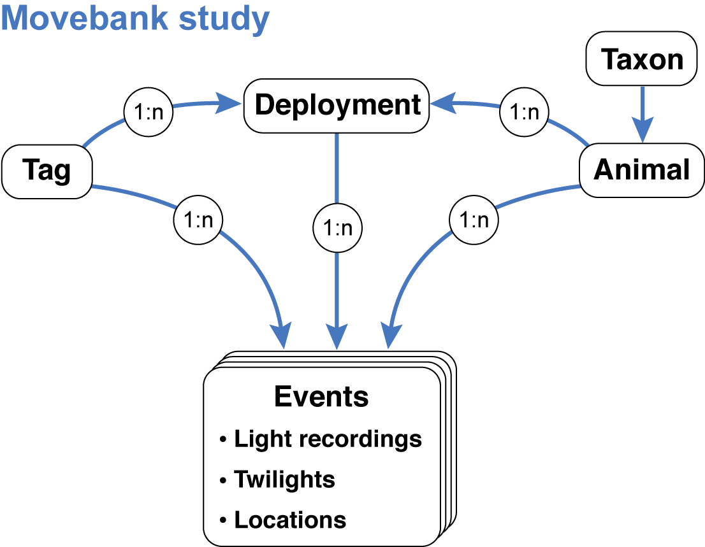
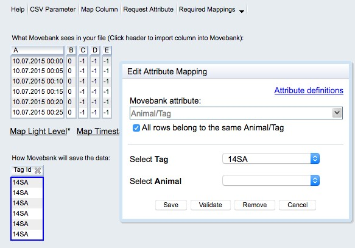
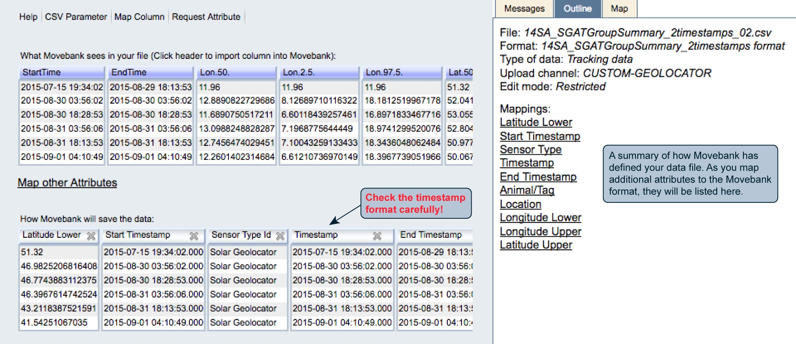

# Data repositories {#repositories}

Archiving geolocator data is not only good scientific practice, it is a precondition for publication in a growing number of journals. Proper archiving retains the value of the data for future (re‐)analyses, allowing for re‐analysis with new analytical methods or an overarching syntheses. As there are several tools that could potentially be used, and each requires specific values for a suite of parameters, it is crucial to archive both raw data and location estimates in conjunction with the code that led to the specific results.
	
Although several databases exist for sharing and archiving animal movement data, the foremost as a general research platform for animal movement data is [Movebank](www.movebank.org/node/2). Movebank is particularly well suited for geolocator data as it includes features tailored to tracking based on ambient light levels, supporting storage of raw light recordings, twilight annotation tables, location estimates with credibility intervals and custom files such as R scripts or model output, along with deployment‐ and study‐level metadata. Researchers are encouraged to publish their data in the public domain, which can be done by publishing in the Movebank Data Repository, wherein a dataset can acquire a digital object identifier (DOI), persistent link, licence and citation after undergoing review. For in‐progress work, Movebank provides a range of sharing options, for example allowing owners to store and manage data privately, give access to specific researchers and allow the public to discover but not access the data or to download data after accepting owner‐defined terms of use. We recommend storing data in Movebank or similar repositories even during preliminary analysis stages when the results and analyses remain unpublished. In these situations, the online archive provides a secure backup and can be discovered by other researchers who can contact the owner about potential collaboration using the data.


## Basic principles of storing data in _Movebank_

Movebank is a free online database and research platform for animal movement and other animal-borne sensor data hosted by the Max Planck Institute of Animal Behavior. Researchers retain ownership of their data and can choose whether and with whom to share their data. All data are stored within user-owned studies. You can access and analyze Movebank data directly within R using the [move](https://cran.r-project.org/web/packages/move/index.html) package. The basic steps to archiving a dataset on Movebank are:


1. **Register on Movebank** If you are not registered already, create an account at https://www.movebank.org/user/register.
2. **Create a study** Typically users create a study for each project, but for large projects you may want to create studies for each species or deployment site. Consider this carefully because there is no automated way to move data between studies later. We recommend that you provide sufficient detail in your study name, citations and objectives to inform others about your project. Also notice that you can set License Terms that must be accepted by anyone with permission to download your data.
3. **Set the access and sharing permissions** Set the permissions for your study to define whether the public or specific collaborators can view or download data, and assign other Movebank users as collaborators or data managers. You can update these settings at any time. We recommend that you make at least the study name and summary visible to the public so that your work can be discovered.
4. **Import data** You can import tables of raw light recordings, annotated twilights, location estimates and deployment information. More detailed instructions follow in Section 9.2.	5. **Submit for publication** The Movebank Data Repository is a long-term public archive of Movebank studies that provides authors with a DOI and research citation for their datasets. When you have completed your data analysis we recommend submitting your dataset for publication. Researchers typically submit when their related manuscripts are in review.

Section 9.3 provides examples of published geolocator studies. Movebank’s user manual provides more details about managing studies, accessing data and analysis tools. For help, contact support@movebank.org.


## What can (and should) be stored in Movebank

Besides the results (location estimates), Movebank enables users to store all relevant information and data to repeat the analysis or reanalyze the data using different methods. This is done by storing four data tables that contain (1) raw light recordings, (2) annotated twilights, (3) location estimates and (4) deployment-level information about the tags, animals, deployments and data processing steps. Movebank will relate these tables using a model that mimics typical tag deployments:

<div style="background-color:rgba(0, 0, 0, 0.0470588); border-radius: 10px; text-align:left; vertical-align: middle; padding:6px 2; width: 700px; margin: auto:">

</div>

After [creating a study](www.movebank.org/node/11) and providing study details, you can begin importing files. With each file import you will map each column in the table to a Movebank data attribute. All attributes are defined in the [Movebank Attribute Dictionary](www.movebank.org/node/2381) and a persistent, machine-readable version is published at http://vocab.nerc.ac.uk/collection/MVB/current. While each study and set of files is a bit different, we will walk through the import steps in a recommended order below. Also see Movebank’s instructions for [importing custom tabular data](www.movebank.org/node/12). We are preparing a complete example of all steps in the study “Light-Level Geolocation Manual” (study ID [788381694](https://www.movebank.org/panel_embedded_movebank_webapp?gwt_fragment=page=studies,path=study788381694)).


### Raw light recordings
These are the files you obtain from your geolocators. Movebank can accept most delimited tabular data files with or without a header row. Any rows in the header other than column names must be removed before importing. Information stored in the header can be integrated into the reference data, compiled and added as a file attachment to the study, and/or included in the readme if the data are published in the Movebank Data Repository. You can import one file per tag or one file with data from multiple tags. If you have many files, it can be easier to merge the light-level data into one or a few files that contain a tag ID column prior to importing to Movebank (see more below). To import a light-level file,
* From your study select **Upload Data > Import Data > Light-level data**.
*  Browse to the file and select **Upload**. 
A window will open previewing “What Movebank sees in your file” and “How Movebank will save the data”. If nothing appears under “How Movebank will save the data”, or if the first row is not read correctly, select **CSV Parameter** to adjust how the file is read.
* **Set Reference to Animal/Tag**: If the file contains data for a single tag and does not contain an ID column, check the box next to “All rows belong to the same Animal/Tag”. You can either select the IDs from a list (if you have already imported the reference data, see below) or create new ones. If the file contains an ID column, select the relevant column/s. You are only required to map a Tag ID—you can either map an Animal ID in this step or relate the tags to animals with your reference data table. When you are done select **Save**.

<div style="background-color:rgba(0, 0, 0, 0.0470588); border-radius: 10px; text-align:left; vertical-align: middle; padding:6px 2; width: 700px; margin: auto:">

</div>

* **Map Timestamp**: You can map one or more date-time columns to Movebank’s “Timestamp” attribute. Use “+” to add additional columns if needed. Provide the format string for each column based on [this key](https://docs.oracle.com/javase/6/docs/api/java/text/SimpleDateFormat.html). When you are done select **Save**. The format displayed under “How Movebank will save the data” is yyyy-MM-dd HH:mm:ss.SSS. _Please check your timestamp format carefully_! In particular, Movebank sometimes guesses months and days incorrectly if no days above 12 are in the top portion of the file. It can be easy to overlook this mistake with data from non-location sensors. 
* **Map Light Level**: Choose the column that contains the light values and select Save. Now your file should be ready to import.

<div style="background-color:rgba(0, 0, 0, 0.0470588); border-radius: 10px; text-align:left; vertical-align: middle; padding:6px 2; width: 700px; margin: auto:">

</div>

Select **Finish**. You will have the option to filter duplicate records (typically not present in light level files) and to save a copy of your file format. Save the format, giving it a name like “lig files” or “glf files”, so that you can import additional light-level files to the study without having to repeat these steps each time. 
Select **Ok**. Depending on the file size processing may take a few seconds or several minutes. Once the file is imported, you can import more light recording files or move on to annotated twilights (below).


### Annotated twilights

We are in the process of adding a new sensor type to Movebank to support storage of twilight files. Once this is done we will add instructions and examples. In the meantime, you can prepare these files using the following new functions:
FLightR
GeoLight
SGAT - `SGAT2Movebank`

### Location estimates

The results of geolocator analysis are typically a file containing estimated location coordinates for each animal over the deployment period and which may include additional columns with information such as location accuracy or migration stage. When possible we recommend including upper and lower bounds for the location estimates that can be chosen using e.g.  `SGAT2Movebank` packages. To import this file, follow the instructions for [“importing custom tabular data”](www.movebank.org/node/12) in Movebank’s user manual. Below are details specific to geolocation-based location estimates.

The times and locations of deployment and recapture can be represented in two ways in Movebank: (1) in this file with the location estimates and (2) in the reference data (more below). If you include these records in this file, be sure to indicate this because they are of course more accurate than the estimates from geolocation analysis. The easiest way to do this is to add a “comments” column to the file and a note “known deployment location”, or something similar, to those records.

* From your study select **Upload Data > Import Data > Processed solar geolocator data > other geolocator data**.
* Browse to the file and select **Upload**. 
Map the following columns:
* **Sensor Type**: If this is not mapped already, check the box next to “Set fixed Sensor Type for all rows” and choose “Solar Geolocator”. 
* **Animal/Tag IDs**: Each location must be associated with a Tag ID, and can then be associated with an Animal ID using this file or by defining deployments in the reference data (see below). 
* **Timestamps**: For your location estimates, you might have either a single timestamp or start and end timestamps associated with each record. If you have one timestamp per location, map this to the “Timestamp” field. If it represents the beginning of the period for which the estimate is valid, also map this to “Start Timestamp”. If you have start and end timestamps for each location, map the start timestamp to “Timestamp” and “Start Timestamp” and the end timestamp to “End Timestamp”. Please check your timestamp format carefully!
* **Location Lat and Location Long**: Select the columns that contain the latitude and longitude estimates. 
* **Upper and lower coordinate bounds**: Where possible we recommend including the upper and lower location bounds. To do this, select Map other Attributes, Map Column or a column header under “What Movebank sees in your file”. The related Movebank attributes are listed as “Latitude Lower”, “Latitude Upper”, “Longitude Upper” and “Longitude Lower” under “Other attributes”. You can further define these bounds using “Location Accuracy Comments” in the reference data (see below).
* **Geolocator Fix Type**: Provide the period of day (e.g. “sunrise”) used to estimate the location. 
* **Comments**: As described above, here you can indicate high-accuracy records from known locations that were not derived from the geolocation analysis.
* **Additional Attributes**: To map other attributes you might want to include, see the Movebank Attribute Dictionary for available attributes.
Once you are done mapping columns your preview should look something like this.

<div style="background-color:rgba(0, 0, 0, 0.0470588); border-radius: 10px; text-align:left; vertical-align: middle; padding:6px 2; width: 700px; margin: auto:">

</div>


After finishing the import, if you mapped both Tag and Animal IDs, you might be directed to the Deployment Manager to accept deployments created based on the data in your file. If you haven’t yet added deployments, it is fine to accept these, however for your final deployments, we recommend importing a reference data file that contains additional information important to understanding geolocation studies.


### Reference data
In Movebank, “reference data” includes information about animals, tags and deployments. This can be prepared as a table with one row per deployment, and allows you to document additional details about your geolocator analysis methods. The following reference data for bird 14SA in our example study “Light-Level Geolocation Manual” includes recommended reference data attributes to include for geolocation studies, with notes in italics.
	
* **tag-id**: 14SA (tag, animal and deployment IDs can be the same or different)
* **animal-id**: 14SA
* **deployment-id**: 14SA_2015
* **animal-taxon**: Merops apiaster (use a taxon that is valid at itis.gov)
* **deploy-on-date**: 2015-07-13 00:00:00.000
* **deploy-off-date**: 2016-07-15 00:00:00.000
* **animal-life-stage**: adult
* **animal-mass**: 108.0 (grams)
* **animal-reproductive-condition**: breeding
* **animal-ring-id**: SA40838
* **animal-sex**: f
* **attachment-type**: harness
* **data-processing-software**: TwGeos v0.0-1, SGAT v0.1.3
* **deploy-off-latitude**: 51.32
* **deploy-off-longitude**: 11.96
* **deploy-on-latitude**: 51.32
* **deploy-on-longitude**: 11.96
* **deployment-end-type**: removal
* **duty-cycle**: light sampled every 5 minutes
* **geolocator-calibration**: on-bird calibration 2015-07-20 to 2015-08-29
* **geolocator-light-threshold**: 0.5
* **location-accuracy-comments**: upper/lower coordinates are the 95% credible interval calculated with locationSummary, SGAT package
* **manipulation-type**: none
* **study-site**: Saxony Anhalt, Germany
* **tag-manufacturer-name**: Swiss Ornithological Institute
* **tag-mass**: 1.3 (grams)
* **tag-model**: PAM GDL3
* **tag-readout-method**: tag-retrieval

To import this file, follow the instructions for [“Importing reference data about animals, tags and deployments”](www.movebank.org/node/27) in Movebank’s user manual.


### Additional files

**Other data sensors**: You can also include additional sensor data, e.g. from conductivity or temperature sensors on the tag. Follow the instructions above for importing raw light recordings, but select the appropriate sensor type, using “accessory measurements” if the sensor is not listed.

**Other kinds of files: Movebank allows you to store additional files in your study that are not imported to the database. You can use this to store things like R scripts, a text file with the configuration details stored in the header of original light-level files, or more detailed capture data information. From your study select Upload Data > Add 
**Attachments** (see Movebank’s user manual for [instructions to upload file attachments](www.movebank.org/node/5791)).


### Merging files

Here is an example of how to merge files of light recordings or twilights prior to importing them to Movebank. This allows you to import just one file rather than one for each tag. With files exceeding ~500 MB the import process can become slow, so see these tips for importing large csv files. We have successfully imported files up to at least 3 GB.

To merge multiple tabular files in the same format, first get a list of all files in the directory.


```r
filenames <- list.files(path = ".", pattern = NULL, all.files = FALSE, 
                        full.names = FALSE, recursive = FALSE, ignore.case = FALSE)
```

Make a function to read he files and add a column with the filename (where the tag identifiers are typically stored).


```r
read_txt_filename <- function(filename){
ret <- read.table(filename, header=TRUE, sep=";", quote='"', dec=".", na.strings="", 
                  colClasses="character", fill=TRUE, strip.white=TRUE, blank.lines.skip=TRUE) 
                  #, colClasses=c(rep("character", 7), rep("NULL", 6)), blank.lines.skip=TRUE)
                  ret$Filename <- filename
	                ret}
```

Read in the contents of all files to a new data frame.


```r
library(plyr)
dat <- ldply(filenames, read_txt_filename)
```
	
Remove extension from the filenames. Adjust as needed so that the filename values become the Tag IDs you want to use in Movebank.


```r
dat <- lapply(dat, function(findreplace){
	  gsub(".csv","",findreplace)})
```

Save the file with settings that will minimize file size and leave NAs blank.


```r
write.csv(dat, file="merged_files.csv", quote=F, na="", row.names=F)
```


## Examples of geolocator studies in Movebank

The following Movebank studies follow many of the best practices described above and can be publicly downloaded, so you can use them to help organize your own datasets. To search Movebank for publicly visible geolocator studies that include location estimates, go to the Tracking Data Map select “All Sensor Types” and choose “Solar Geolocator”. Geolocator studies published in the Movebank Data Repository are listed at https://www.datarepository.movebank.org/discover?query=geolocator.
	
* ***Light-Level Geolocation Manual** (study [788381694](https://www.movebank.org/panel_embedded_movebank_webapp?gwt_fragment=page=studies,path=study788381694)): We will add additional data to this study following the recommendations above and to share the sample data used in this manual.

* **Vermont Center for Ecostudies Grasshopper Sparrow Migration Project** (study [348283339](https://www.movebank.org/panel_embedded_movebank_webapp?gwt_fragment=page=studies,path=study348283339), published with DOI [10.5441/001/1.c6b47s0r](https://www.datarepository.movebank.org/handle/10255/move.757): This study includes light recordings and location estimates following the recommendations above, and the published dataset also includes an R script and original .lux file to further document the analysis. See Hill and Renfrew (2019a, 2019b).
  
* **Red-necked Phalarope southern Chukotka** (data from Mu et al. 2018) (study [411155573](https://www.movebank.org/panel_embedded_movebank_webapp?gwt_fragment=page=studies,path=study411155573) published with DOI [10.5441/001/1.p41784h5](https://www.datarepository.movebank.org/handle/10255/move.762)): This study includes measurements from conductivity and temperature sensors. Movebank could use input from more data owners with conductivity sensors to improve how we document these.


Hill JM and Renfrew RB (2019a) Data from: Migratory patterns and connectivity of two North American grassland bird species [grasshopper sparrows]. Movebank Data Repository. https://doi.org/10.5441/001/1.c6b47s0r

Hill JM, Renfrew RB (2019b) Migratory patterns and connectivity of two North American grassland bird species. Ecology and Evolution 9(1): 680–692. https://doi.org/10.1002/ece3.4795

Mu T, Tomkovich PS, Loktionov EY, Syroechkovskiy EE, Wilcove DS (2018a) Data from: Migratory routes of red-necked phalaropes Phalaropus lobatus breeding in southern Chukotka revealed by geolocators. Movebank Data Repository. https://doi.org/10.5441/001/1.p41784h5
	
Mu T, Tomkovich PS, Loktionov EY, Syroechkovskiy EE, Wilcove DS (2018b) Migratory routes of red-necked phalaropes Phalaropus lobatus breeding in southern Chukotka revealed by geolocators. Journal of Avian Biology 49(7): e01853. https://doi.org/10.1111/jav.01853 


